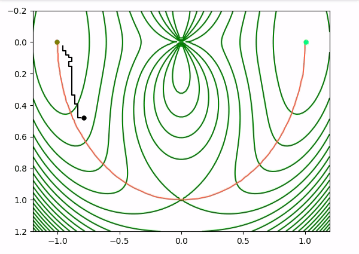
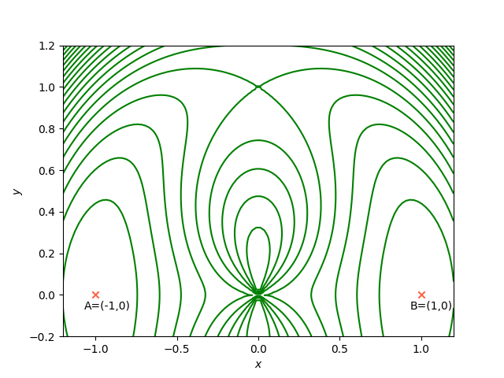
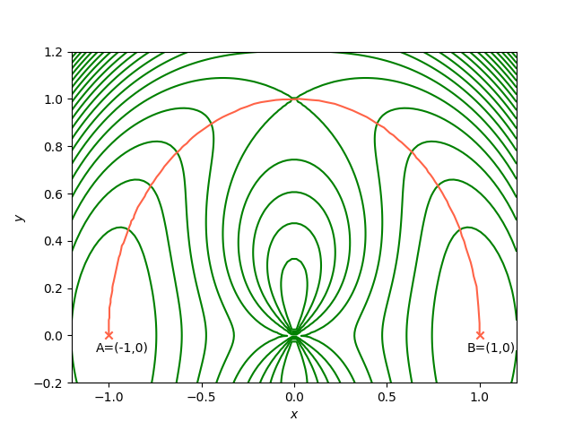
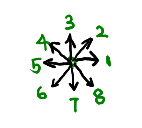

# Adversarial Inverse Reinforcement Learning (AIRL) In 2D Potential Surface

## Build reinforcement learning environment

### The potential surface

The analytical two-dimensional potential surface is given by[1]

$$
V(x, y)=\left(1-x^{2}-y^{2}\right)^{2}+y^{2} /\left(x^{2}+y^{2}\right)
$$

The potential has two minima at $A=(-1,0)$ and $B=(1,0)$, respectively, and $x \in [-1.2, 1.2]$,  $y \in [-0.2, 1.2]$

### The model of 2D potential surface

Consider the environment as a two-dimensional harmonic oscillator. 

### The state (observation) space

The observations (states) of the agent is the positionsand velocities $s \in \{ x, y, v_x, v_y\}$. 

- $x \in [-1.2, 1.2]$
- $y \in [-0.2, 1.2]$
- $v_x,v_y \in [-v_{\text{max}},v_{\text{max}}]$

### The action space

The agent's  $\text{action} \in \{0,1,2,3\}$. All actions are allow to be continuous values.

- $F_p$: force given by potential surface.
- $f_1$: force giving to the agent to keep the agent balance.
- $f_2$: force giving to the agent to let the agent move.

Note that $\vec{F_p} + \vec{f_1} = 0$, which indicating $F_p$, $f_1$ share same magnitudes but have opposite directions.

Project the three forces to $x,y$ directions, then we get,

$$
F_{p_x},\  F_{p_y},\  f_{1_x},\  f_{1_y},\  f_{2_x},\  f_{2_y}.
$$

$\text{Actions} \{0,1,2,3\}$ corresponding $\text{Forces}\{f_{1_x},\  f_{1_y},\  f_{2_x},\  f_{2_y}\}$

### Observation update rule

The force the potential surface giving to the agent can be split to two, 

$$
F_{p_x} =-\frac{\partial{V}}{\partial{x}} =  4 x\left(1-x^{2}-y^{2}\right)+\frac{2 x y^{2}}{\left(x^{2}+y^{2}\right)^{2}}
$$

$$
F_{p_y} = -\frac{\partial{V}}{\partial{y}} = 4 y\left(1-x^{2}-y^{2}\right)+\frac{2 y^{3}}{\left(x^{2}+y^{2}\right)^{2}}-\frac{2 y}{x^{2}+y^{2}}
$$

Then,

$$
f_{1_x} = - F_{p_x} \\　f_{1_y} =-F_{p_y}
$$

Then the forces or accelerations in $x$,$y$ directions,

$$
a_x = f_{2_x}
$$

$$
a_y = f_{2_y}
$$

The velocity and position are updated by

$$
v_{x_{t+1}} = v_{x_{t}} + a_{x_t}
$$

$$
x_{t+1} = x_{t} + v_{x_{t+1}}  
$$

$$
v_{y_{t+1}} = v_{y_{t}} + a_{y_t}
$$

$$
y_{t+1} = y_{t} + v_{y_{t+1}}
$$

### Code the environment

Use [WebPlotDigitizer](https://apps.automeris.io/wpd/), sample points along the minimum-energy reaction path (MEP) can be obtains from FIG.1 in [1].  As plotted in tomato as 

## Get expert demonstrations

In order to get expert demonstrations easily, an action $f_2$ simulator was made as below:

Through this simulator, then

$$
f_{2_x} = N \cos((n-1)*\frac{\pi}{4})
$$

$$
f_{2_y} = N \sin((n-1)*\frac{\pi}{4})
$$

where $n$ is action number, $N$ is the same magnitude of different force. 

Specifically, $f_{2_x} = f_{2_y} =0$ if $n=0$, which means the force $f_2=0$.

20 expert demonstrations were obtained. The traces were as bellow:

A typical changes of observations and actions for an expert trajectory was as bellow:

## Apply AIRL in 2D potential surface

## Check the learned reward function

## Check the learned policy

## Use learned reward function to train a optimal function

## Reference

1. [Simplified and improved string method for computing the minimum energy paths in barrier-crossing events](https://www.researchgate.net/publication/6351826_Simplified_and_Improved_String_Method_for_Computing_the_Minimum_Energy_Paths_in_Barrier_Crossing_Events)
